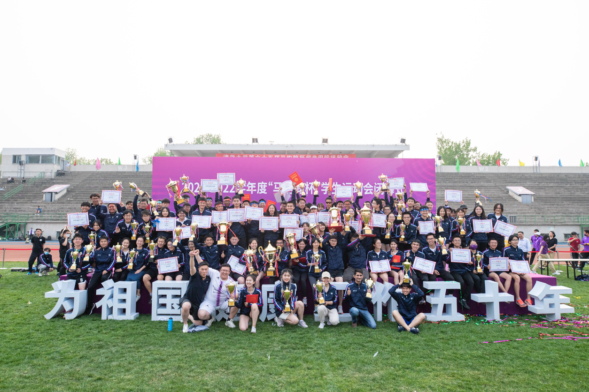
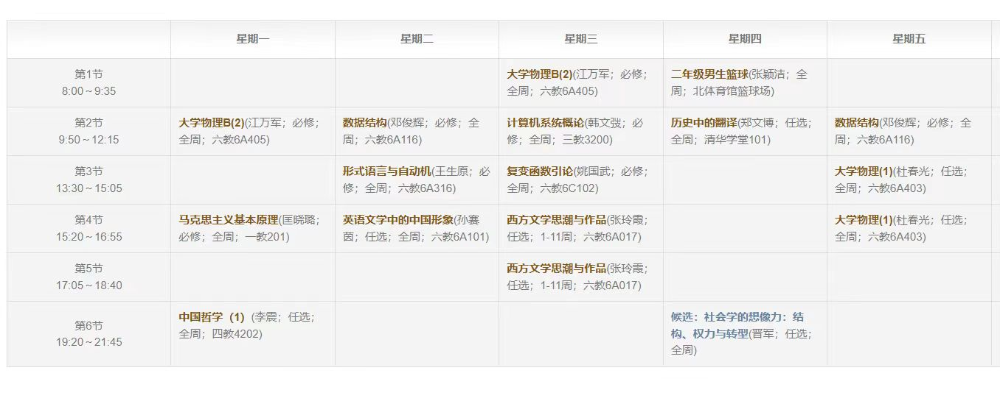
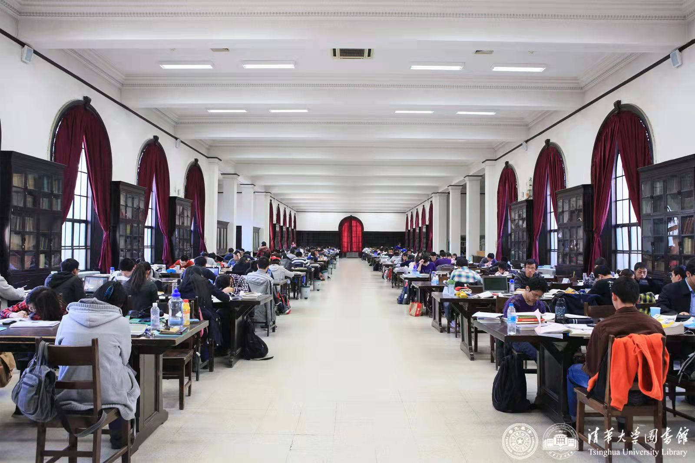
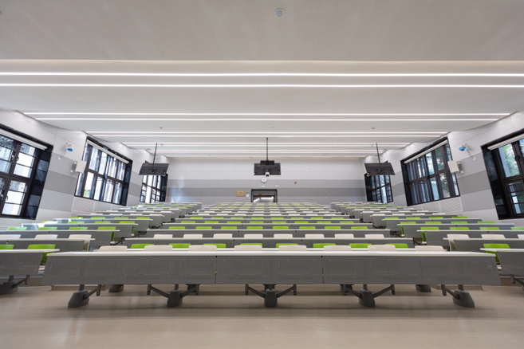
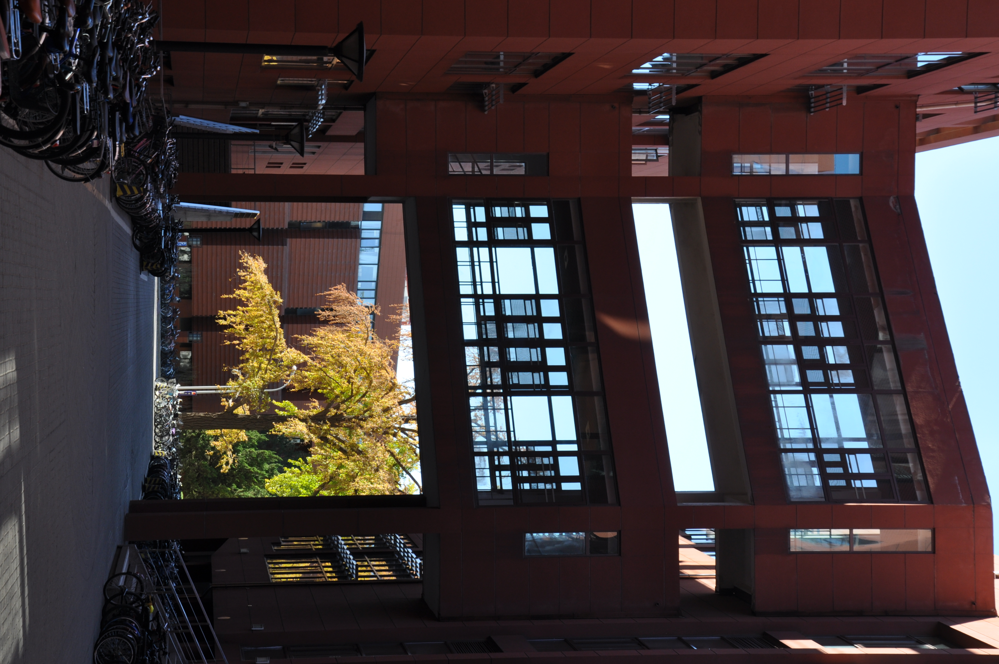
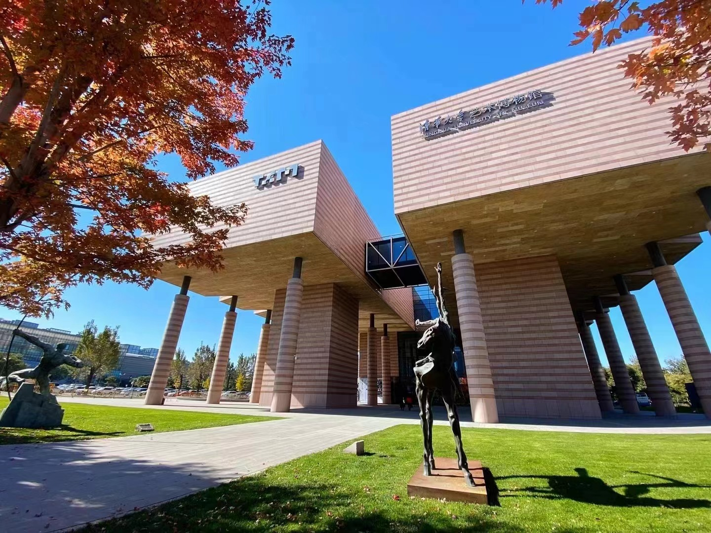

# 走进清华

## 校园生活

> 清华校园生活部分官网链接 [https://www.tsinghua.edu.cn/zjqh.htm](https://www.tsinghua.edu.cn/zjqh.htm)
>
> 这部分主要参考了清华官网，并添加了部分个人经历。

### 学生活动

#### 主题教育

主题教育是清华大学学生培养中的重要工作。“又红又专”，“为祖国健康工作五十年”是每一个清华人所熟知的口号。同时，不同于大部分高校拥有专职辅导员，清华有科研社工“双肩挑”的辅导员制度，辅导员由研究生或高年级本科生来担任。

每个班级在每个学期都会开展至少一次主题团日活动，作为主题教育的一部分。主题教育的开展形式是多元的，比较经典的班团活动包括爬香山、参观国博等。

#### 集体建设

“班集体”“团支部”的概念深入每一位清华同学的心中，男生节、女生节等也是各个集体每年一度的盛事。班级是同学的第一集体，同学们在这里探讨学习和集体生活中的问题，开展丰富多彩的素质培养活动，营造互帮互助、共同进步的班级文化。

每年各个班集体都会开展丰富的支部事业活动，如志愿服务、公益事业、前沿探索等，展现出清华人的多样风采。

> 大学的班级概念并不像高中一样那样明确，但清华的班级建设情况相比其他院校还是相对可以的。

#### 社会实践

社会实践是清华大学的优良传统和学生假期生活的重要组成部分。同学们在每个假期都可以报名参加心仪的社会实践支队，每个院系也都有符合院系特色的主题实践支队。社会实践是清华同学的必修课，在大一或大二暑假，所有同学都需要走入社会，调研实践，认识世情国情社情民情。

**实践主题**

学校将社会实践与思想教育、专业学习、集体建设、志愿公益、就业选择相结合，引导学生在社会实践中“受教育、长才干、作贡献”，培养深厚的家国情怀和强烈的社会责任感。实践主题丰富多元：

* “初心一百年” “重走总书记初心之路”“决胜小康2020”“学习调研团”等**学习调研类**实践，与党课学习、读书学习相结合，让学生带着问题出发，调研国情民情，追寻党的初心
* “中国力量”**行业认知类**实践，依托院系，引导学生了解行业发展与学科前沿
* 本科生海外实践支持计划、全球胜任力海外实践课程等**海外类**实践，支持学生在“一带一路”上回看中国，提升全球胜任力，很多同学第一次出国就是参与清华大学的海外实践支队
* “创益筑梦”**公益类**实践，引导学生利用专业知识和各方资源，为服务社会贡献力量；“江村学者”长期型、学术性、调研类实践，培养学生调研能力，加强实践成果产出
* “聚焦京津冀”**区域调研类**实践，围绕“京津冀协同发展”战略，引导学生为首都发展出谋划策
  
> 清华二中er们参加过的实践支队曾前往：美国、意大利、新加坡、印度尼西亚等国家，湖南省湘西州、重庆、深圳等国内城市

<figure markdown="span">
  { width="400" }
  前往美国西雅图清华大学-华盛顿大学全球创新学院参观
</figure>

**实践感想**

当你真正走入基层，走到乡间的土地，走进学校的课堂时，你会看到不同的事物，听见各样的声音，发现新的东西。我想做什么、我能做什么——这是我时常问自己的问题，而我并不很清楚。整个实践，就是一种探寻，一次问道，一次解答的尝试。

#### 学生社团

全校现有在册学生社团266家，分为文化、艺术、体育、科创、公益和素质拓展6大类别，会员总数超过3.4万人次，平均每名本科生在校期间加入2.6个学生社团。

清华大学学生社团有着悠久的历史和深厚的底蕴。早至上世纪初，美术社、科学社、文学社、唯真学会、戏剧社等不仅留下了创办者叶企孙、闻一多、梁实秋等前辈的足迹，更展现了清华学子全面发展、追求卓越的精神风貌。改革开放后，特别是上世纪九十年代以来，学生社团蓬勃发展、百花齐放，涌现出一批在校园内外具有积极影响的优秀学生社团。

> 每个学期初的百团大战还是有点壮观的，刚入学的时候就是什么社团都感兴趣都想参加）

#### 创新创业

校园内形成了以“挑战杯”为龙头，创意大赛、机械创新设计大赛、电子设计大赛、数学建模竞赛、结构设计大赛、人文知识竞赛、“今经乐道”经济热点分析大赛等58项院系学术科技竞赛构成的赛事体系，每年吸引超过5000名学生参加。设立“大学生学术研究推进计划”，“星火计划”，学生科技兴趣团队，鼓励学生自主创新。

**创意激发**。创意激发环节通过讲座、培训、比赛等形式，实现创业基本概念和知识的普及。1998年，清华大学在亚洲高校中率先引入了美国的商业计划竞赛，形成了“昆山杯”清华大学创业大赛。“清华创业堂”是学生创业协会主办的品牌沙龙讲座类活动，邀请嘉宾与同学分享投资的心得以及创业的规律与体验。

**创新培养**。学校将创业教育引入学生教学培养计划，开设“SRT自主创新创业专项”训练。同时，面向全校本科生开设《大学生创新创业基础》课程，旨在帮助学生了解创新型创业常见模式、过程，掌握基本的创新方法与创业技能。

同时，学校还会提供各种资源支持，如资金、教学课程、实践与创业训练项目等。

#### 体育活动

作为提倡**为祖国健康工作五十年**的“五道口体校”，清华大学有着坚实的群众体育基础和浓郁的竞技体育氛围。“马约翰杯”（马杯）是学校里最主要的体育盛会，它几乎包含了你能想到的所有体育项目，从三大球三小球到棒垒球，从田径到健美，马杯为所有体育爱好者们提供了一个展现自我、公平竞技的舞台。

> 清华二中er们参与过的马杯大项包括但不限于：篮球、排球、足球、乒乓球、定向越野、毽绳……

<figure markdown="span">
  { width="400" }
  “马约翰杯”闭幕式
</figure>

### 学习生活

> 大学生哪有不疯的？硬撑罢了！

#### 详尽的培养方案

* **细致到学期的教学计划**：不同于部分 ~~隔壁~~ 大学没有以学期为单位的详细教学计划，清华大学每个专业都有详细的选课指导计划，在给同学们指明大方向的同时也留有DIY的余地

    > 喜欢折磨自己的，可以快乐地选30+学分，体验不一样的人生

    <figure markdown="span">
      { width="600" }
      这么多课，真的能学下来吗😨
    </figure>

* **多样的课程选择**

    * **中英文课堂**：很多课程都会同时开设（至少）一个英文课堂，给喜欢挑战自己的同学、希望出国的同学一些新的选择
    * **授课方式**：除了传统的授课方式，还有与线上MOOC结合的融合课堂，也有同学当主讲人的“翻转课堂”
    
        > 我当时就选择了MOOC的大学物理课，课余时间看MOOC学习，上课与同学讨论，对我来讲学习效率更高也学得更透彻

    * **讲课老师**：很多非常有特点的老师，大家可以选择适合自己的类型
    * **上课时间**：每天分为六大节课，从早八到晚十
    
        > 真的有人喜欢上早八吗

* **方向全面的限选课**：以计算机系为例，计算机系的本科生们需要学习约6门限选课，而系里开设了40余门各种方向的限选课供同学们选择
  > 啥都学一点，~~啥也学不会~~

* **有趣的思政课**：没有死记硬背，只有深入的思考！

* **大量通识课、体育课**：你上过院士开设的新生研讨课吗？在清华你可以！你上过奥运冠军和国家队教练开设的体育课吗？在清华你可以！

<figure markdown="span">
  { width="250" }
  捕捉大师球！
</figure>

#### 良好的学习环境

* **图书馆**：北馆、西馆、老馆、文科图书馆、法律图书馆、金融图书馆、美术图书馆……
    
    * 环境好、座位多、藏书多
  
    <figure markdown="span">
      { width="400" }
      老馆如今已经翻新
    </figure>
    
* **教学楼**：一教到六教，四年之内翻新其中三个
  
    * 数量多、环境好
  
    <figure markdown="span">
      { width="400" }
      是新鲜的三教！
    </figure>

#### 多样的学习资源

* **学生学习与发展指导中心**
    * 小班辅导：考前定制复习课，助力最后冲刺
    * 写作助理：必修的《写作与沟通》遇到困难？优秀学长学姐给你一对一服务！
    * 答疑坊：每日值班轮岗，各种课程答疑，就等你来问

* **学生心理发展指导中心、学生职业发展指导中心**

* **海外交换、暑研项目**
    * 与牛津大学的“英华学者”项目：大三学年前往牛津大学交换一整年
    * 校级交换项目：前往全球顶尖学府，康奈尔大学、加州大学伯克利分校……
    * 暑期科研：与麻省理工学院、哈佛大学等学校合作

* **......（等你来探索！）**

## 校园景观

记得开导航。

### 教学设施

  清华有非常多教学楼，其中最主要的是**第六教学楼**。六教位于清华大学主楼西北侧，为综合教学科研设施。六教建筑布局结合校园规划与本区域北高南低的自然条件，结合教学模式和使用者的环境行为，将建筑分为相对独立的A、B、C（即中、小、大）三个教室区，各区围绕中心广场布置；将C区设计为1/4圆型，既与其使用功能相契合，同时也巧妙地保留了地段内五棵古松，营造出颇具校园文化气息的主题环境；通过轴向室外广场和中心下沉广场的设置，形成了多向视线通廊和内外空间的渗透。设计以最佳的教学科研单元体为核心，完善公共服务空间，营造交流空间；所有功能用房单廊布置，中间设置中庭并可自动开启其顶侧窗，具有良好的自然采光和通风。该建筑风格质朴典雅，体现了校园建筑内在的文化特质。

  > 很多教学楼，其中六教非常大。三教、四教设施很好。

<figure markdown="span">
  { width="400" }
  在清华不迷路需要一周，在六教不迷路需要一年 ~~错啦，两年半之后还在迷路😭~~
</figure>
  

### 紫荆公寓区

  **清华大学紫荆学生公寓区**位于校园北部，总占地28.4公顷，总建筑面积37万平方米，是目前国内规模最大的现代化学生公寓。公寓区的主体建筑为徽派建筑，分为本科生区、研究生区、留学生区和继续教育学员区，其中博士生公寓楼因排列为英文字母“W”形，而被学生称为W楼。公寓区内的花园绿地之中，紫荆亭亭玉立，生机勃勃的生态景观体系，新颖、现代又不失活泼。公寓区内配有紫荆园和桃李园两座现代化学生餐厅、超市、学生服务楼、紫荆操场，网球场等设施，为学生生活提供了便利的条件。

  > 楼老了点儿，但宽敞且**上床下桌**

<figure markdown="span">
  { width="400" }
  楼下就是紫荆花！
</figure>

### 体育设施

  东操，西操，紫操，你可以在东操参加音乐跑，在紫操夜话，在西操开party。你可以感受到校园的活力和青春气息。

<figure markdown="span">
  { width="400" }
  夜聊专用场地
</figure>
  
  清华还有很多室内体育场所，比如历史悠久的西体、能容纳3000多人的综合体育馆、刚刚完成翻新的气膜馆，以及拥有豪华冰场的北体育馆。

  > 清华的体育场地面积大于**7个未名湖**~~（加上北体是不是就得9个未名湖了）~~。

### 水木清华 & 荷塘

  水木清华是清华园内最引人入胜的一处胜景，地处工字厅后门外。四时变幻的山，环珑着一泓秀水，山林之间掩映着两座玲珑典雅的古亭，正额“水木清华”四字，庄美挺秀。“水木清华”四字，出自晋人谢混诗：“惠风荡繁囿，白云屯曾阿，景昃鸣禽集，水木湛清华。”正中朱柱上悬有清道光进士，咸、同、光三代礼部侍郎殷兆镛撰书的名联：“槛外山光历春夏秋冬万千变幻都非凡境，窗中云影任东西南北去来澹荡洵是仙居。”
  
  这里也是朱自清笔下的《荷塘月色》中描述的地方。下面我们来回顾一下初中课文（狗头）

  > 月光如流水一般，静静地泻在这一片叶子和花上。薄薄的青雾浮起在荷塘里。叶子和花仿佛在牛乳中洗过一样；又象笼着轻纱的梦。虽然是满月，天上却有一层淡淡的云，所以不能朗照；但我以为这恰是到了好处——酣眠固不可少，小睡也是别有风味的。月光是隔了树照过来的，高处丛生的灌木，落下参差的斑驳的黑影；弯弯的杨柳的稀疏的倩影，象是画在荷叶上。塘中的月色并不均匀；但光与影有着和谐的旋律，如梵玲上奏着的名曲。

<figure markdown="span">
  { width="400" }
  朱自清像与荷塘 ~~雨课堂~~
</figure>

### 清华大学早期建筑群

  清华大学大礼堂位于清华大学中部，与二校门隔大草坪相望。大礼堂仿自美国弗吉尼亚大学的图书馆，是一座罗马式和希腊式的混合古典柱廊式建筑，设计者以美国19世纪典型的大学校园布局为蓝图，规划了早期的清华校园。1921年建成时建筑面积1840平方米，是当时中国大学中最大的礼堂兼讲堂。
  
  清华学堂位于大礼堂大草坪的东南方，是德国古典风格建筑。1925年，学校在此设立“国学研究院”，著名的“四大导师”——梁启超、王国维、陈寅恪、赵元任等曾在此任教。

  位于清华大学礼堂前大草坪南端的古典计时器日晷，是1920（庚申）级学生毕业时，献给母校的纪念物。上部是日晷的造型，下部底座分别镌刻着1920级的铭言“行胜于言”的中文及其拉丁文原文，以及建造年月日。“行胜于言”也是如今清华大学的校风。

  这些建筑和图书馆、体育馆等共同构成了清华大学早期建筑群，是全国重点保护文物。

<figure markdown="span">
  { width="400" }
  经常出现在宣传片里的建筑
</figure>

  建校百年（2011年）在学堂路旁修建了新清华学堂，拥有学校里最大的会场，承办了很多演出和晚会。
  
<figure markdown="span">
  { width="400" }
  新清🤤嘿嘿嘿新清🤤
</figure>

### 二校门
  
  **二校门**位于清华路，是清华园内最具代表性的标志性建筑之一，被认为是清华大学的象征。二校门为一座古典优雅的青砖白柱三拱“牌坊”式建筑，门楣上书刻有清末大学士那桐的手迹“清华园”三个大字。站在清华路，北望二校门，可遥看清华大礼堂、日晷和清华学堂等景观。
  
  二校门是清华最早的主校门，始建于1909年。1933年，校园扩建，园墙外移，有了新的大门（今日的西校门）。此后，这座最早的校门就被称为“二校门”。春夏秋冬，年年岁岁，时光荏苒，矗立在校园主干道上的二校门，在风雨中，默默见证着清华大学的历史与发展。它不仅仅是清华园的鲜明标志，更是长期以来清华人勤奋求实、荣辱不惊之品格的象征。

  有同学可能会好奇为什么二校门非常干净，不曾留下任何污渍，这是因为二校门在最后一次翻修的时候使用了一种特殊的纳米涂料，能够保证其一尘不染，据说向它泼可乐都没有问题。

<figure markdown="span">
  { width="400" }
  所以可以泼可乐吗
</figure>

### 近春园

  近春园是清咸丰皇帝的旧居，景点的核心景观是被一偌大荷塘包围的一座岛，岛上有高低的山丘和树林掩映岛西南侧有一古式长廊，此岛通过一座汉自玉拱桥与岸边相连。2024年春天将有两对中央党校赠送的黑天鹅入住，除此之外还有很多鸭子和鸳鸯。

  > 在校医院旁边，附近还有牡丹园，赏花、散步、养老胜地。

### 清华大学艺术博物馆

  清华大学艺术博物馆是一个充满文化气息的地方，它收藏了大量的艺术品和文物，展示了中国的传统文化和艺术魅力。2020年，清华大学艺术博物馆被评定为第四批国家一级博物馆，是高校博物馆首次晋级国家一级馆。

  > 展馆内容还是很不错的，主要对清华学生免费（x）。对外收费开放。

<figure markdown="span">
  { width="400" }
  是在校生都时不时会来逛一逛的地方
</figure>

### 更多信息

请参考 [https://www.tsinghua.edu.cn/zjqh/syxx/xczy.htm](https://www.tsinghua.edu.cn/zjqh/syxx/xczy.htm)