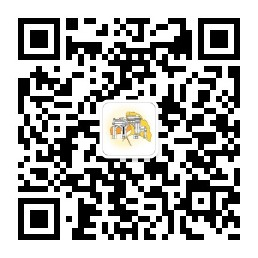

# 欢迎来到“清”气养人的网页！

## 我们是谁
“清”气养人是清华大学北京二中情系母校支队的名称。“情系母校”是由清华大学团委与清华大学招生办公室共同主办的大型志愿活动，鼓励清华同学组队返回高中母校，通过开展面对面的讲座、咨询、展览等系列活动，分享学习心得，传播清华文化，用实际的行动感恩高中母校，用热情的展示谱写清华风貌。

从2022年开始，清华二中er们每年都组成一支以大一同学为主的支队参与到情系母校活动中。除了这个网站，我们还有[b站账号](https://space.bilibili.com/3493125404231966)和支队公众号，欢迎大家关注！

<figure markdown="span">
  { width="150" }
  公众号二维码
</figure>

## 这里有什么

在左侧的导航栏中，有这么几个部分

* **走进清华**：带你速通清华学习生活
* **专业介绍**：整理了各专业学长学姐们对本专业学习内容的介绍和就读体验分享
* **学习方法分享**：整理了历届学长学姐在寒假宣讲中分享的各科学习方法
* **问答墙**：每年我们会在宣讲群中通过共享文档的形式收集同学们的问题并解答，这里整理了历年的问题和同学的解答
* **其他高校宣讲**：这里整理了北京二中er公众号发布过的其他高校宣讲信息

你还可以通过右上角的搜索栏迅速找到自己想了解的信息。

## 支队成员
感谢大家对情系母校活动的付出！

### 2023
> 共20人

* 刘和磊，支队长，2023届13班➡️软件学院
* 白澈，联络组，2023届13班➡️电子系
* 李昊辰，联络组，2023届13班➡️计算机系
* 李嘉沅，联络组，19航➡️为先书院
* 刘予墨，2023届6班➡️美术学院
* 戚可亭，19航➡️协和
* 徐一凡，公众号组，2023届13班➡️自动化系
* 于浩翀，b站组，2023届13班➡️协和
* 张昊鹏，公众号组、b站组、联络组，2023届1班➡️计算机系
* 张皓然，策划组、联络组，19航➡️航天航空学院
* 冯庚辉，b站组，18航2➡️化学系
* 葛冠辰，策划组，18航2➡️软件学院
* 匡天一，公众号组，18航1➡️未央书院电气工程专业
* 李行初，公众号组、策划组、网页组，18航1➡️为先书院
* 梁梓宸，公众号组、b站组、网页组，2022届3班➡️计算机系
* 刘易佳，联络组，18航2➡️行健书院航空航天工程专业
* 陆洲锋，b站组、公众号组、网页组，18航1➡️未央书院能源动力与工程专业
* 姚舜禹，b站组，18航2➡️经管学院
* 叶芊屿，网页组，2022届1班➡️电子系
* 李嘉懿，网页组、公众号组，17航1➡️计算机系

支队成员详细介绍请见公众号文章：[情系母校 | “清”气养人二代目来啦！](https://mp.weixin.qq.com/s/yKGF-lvfAhHnvLrBL64sZw)

### 2022
> 共12人

* 李行初，支队长，18航1➡️为先书院
* 赵宸宇，策划组，18航1➡️未央书院土木、水利与海洋工程专业
* 刘易佳，策划组、b站组，18航2➡️行健书院力学+航空航天工程专业
* 匡天一，联络组，18航1➡️未央书院电气工程专业
* 葛冠辰，联络组、公众号组，18航2➡️软件学院
* 梁梓宸，联络组、b站组，2022届3班➡️计算机系
* 李彬尧，b站组，2022届2班➡️自动化系
* 冯庚辉，联络组、b站组，18航2➡️化学系
* 陆洲锋，b站组、公众号组、策划组，18航1➡️未央书院能源动力与工程专业
* 李伯犀，公众号组，2022届2班➡️自动化系
* 姚舜禹，公众号组、联络组，18航2➡️经管学院
* 李嘉懿，公众号组，17航1➡️计算机系

支队成员详细介绍请见公众号文章：[情系母校丨成员介绍](https://mp.weixin.qq.com/s/l2gkLvasPDedHzwxOoAKoA)

## 网页维护人员
感谢大家对网页搭建的贡献！
### 2023
李嘉懿、叶芊屿、梁梓宸、李行初、陆洲锋